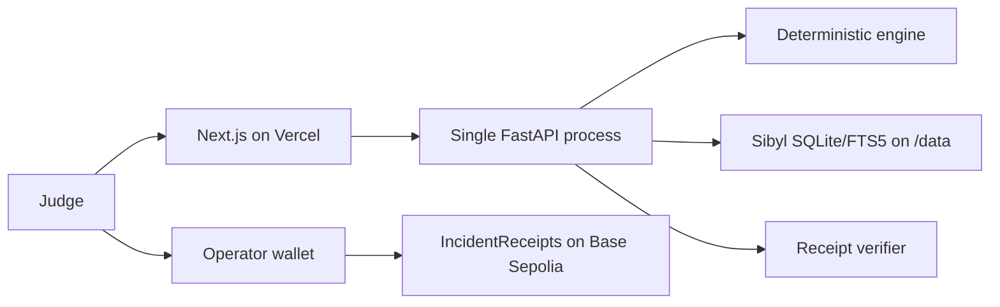

# Architecture

Vercel is stateless and never stores incident memory. The single persistent VM owns the only cross-session database. Session workers are new Python processes and use isolated Sibyl tenants per proof run.

On-chain data contains only four commitments and the recorder address. Telemetry and mitigation outcomes remain simulated.
